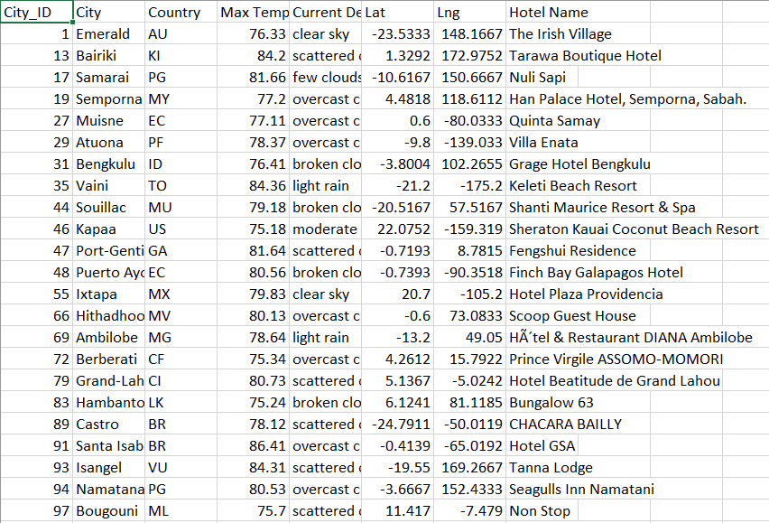
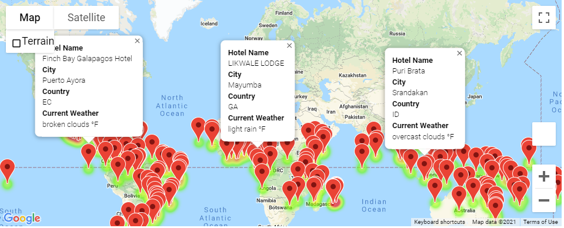
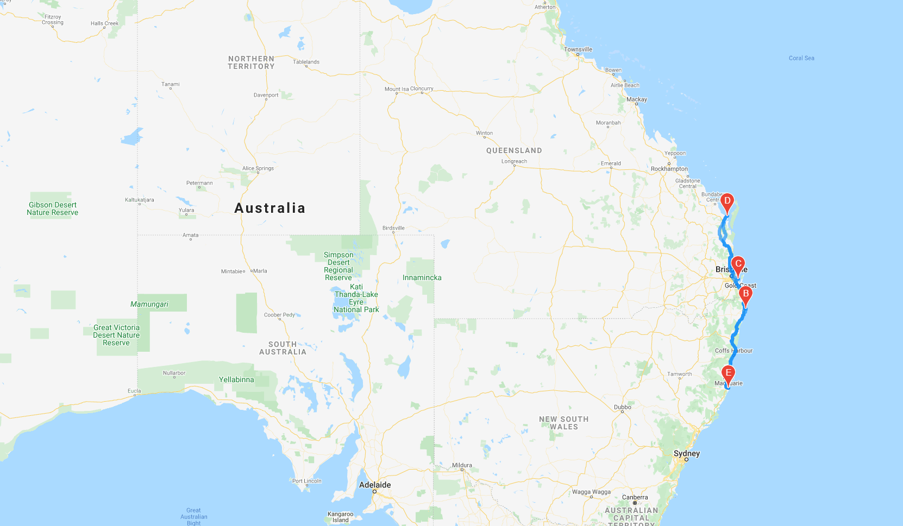
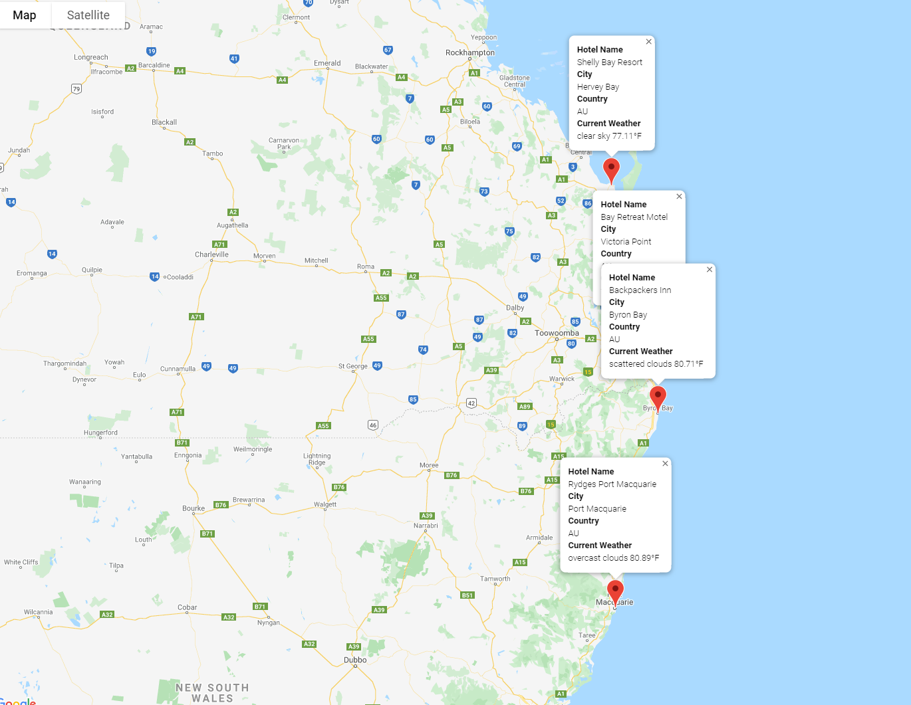

# Creating Travel Destinations & Google Maps direction API - Weather_Database
## Overview of the analysis:
The purpose of this challenge is adding the weather description that was completed in module 6 to the weather data. In this challenge I filter the data for weather preferences, which will be used to identify potential travel destinations and nearby hotels. From the list of potential travel destinations, the user will choose four cities to create a travel itinerary. Finally, using the Google Maps Directions API, I create a travel route (direction layer) between the four cities as well as a marker layer map.

## Results:
Generate a set of 2,000 random latitudes and longitudes, retrieve the nearest city, and perform an API call with the OpenWeatherMap. In addition to the city weather data you gathered in this module, use your API skills to retrieve the current weather description for each city. Then, create a new DataFrame containing the updated weather data.
This image shows the result of the data retrieval in hotel database csv file.

Using input statements customer weather preferences are retrieved, then using those preferences identified the potential travel destinations and nearby hotels. Then, showed those destinations on a marker layer map with pop-up markers.This image shows the result of the vacation search for the given lat and lgn using the hotel database.

Used the Google Directions API to create a travel itinerary that shows the route between four cities chosen from the customer’s possible travel destinations. Then, created a marker layer map with a pop-up marker for each city on the itinerary.
This image shows the result of the map with Google Maps Directions API, the route between four cities chosen from the possible travel destinations.

This image shows the result of the map with a pop-up marker for each city on the chosen possible travel destinations.

## Summary: 
In this challenge I was able to Generate Random Coordinates of World Cities, Retrieve, Collect, and Clean Weather Data, Create heatmaps, and add markers using the Google Maps API using knowledge of Python, decision and repetition statements, data structures, Pandas, Matplotlib, and SciPy statistics. As a result the customer is able to choose a route between four cities with chosen temperature levels and see the round trip and pop-u[ marker for each city including current weather description and temperature on Google map.